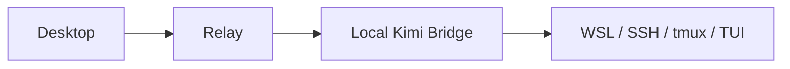
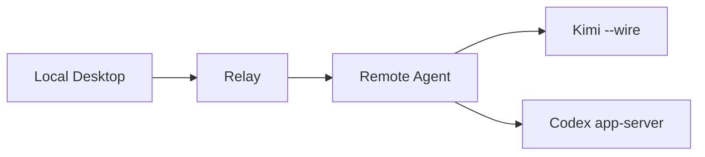

# Agent Control Plane

一个面向远程 AI 编码 CLI 的自托管控制平面。

`Agent Control Plane` 的目标是把分散在远程服务器、不同 CLI、不同终端里的 session 状态与 approval request，统一收回到本地控制端处理。

## Status

当前项目状态：

- 已完成：`P0`、`P1`、`P1.5`、`P2`、`P2.5`、`P3`
- 当前阶段：`P4 Remote-Agent Foundation`
- `V1` 主线：`Kimi` + `remote-agent` + `Multi-Remote` + `Codex`
- `V2` 计划：`Claude Code`

已完成阶段：

- `P0` 项目初始化
- `P1` Relay Core
- `P1.5` Relay 收口
- `P2` Kimi 闭环
- `P2.5` Kimi bridge 收口与远端复核
- `P3` 本地控制端 MVP

当前优先级：

- 建立远端 `remote-agent`
- 将 Kimi 执行链路从本地 bridge 迁移到远端原生执行层
- 保持现有 `relay`、approval 幂等和本地控制端 MVP 规则不回退

## What This Project Solves

这个项目不做聊天 UI，也不做推理链可视化。

它解决的是远程 AI 编码工作流中的控制面问题：

- 多个 remote 上有多个 agent session 在运行
- 不同 CLI 的事件模型和审批机制不同
- approval request 分散在 SSH 终端里
- 本地缺少统一的状态视图和审批入口

项目的一句话目标是：

`让远程 agent 的状态和审批请求稳定、统一地回到本地。`

## V1 Scope

`V1` 只聚焦下面这些能力：

- 一个本地控制端
- 一个本地 `relay`
- 每台远程服务器一个 `remote-agent`
- 统一 session 列表和 approval 列表
- 本地统一 `approve / reject`
- 多 remote 聚合
- 首批 provider：`Kimi`，随后接入 `Codex`

`V1` 明确不做：

- `Claude Code`
- 团队协作和 RBAC
- 云中继服务
- 手机 App
- Windows 桌宠
- macOS 灵动岛界面
- 完整推理链可视化

## Provider Strategy

当前 provider 接入策略已经固定：

- `Kimi`：优先使用 `kimi --wire`
- `Codex`：优先使用 `codex app-server`
- `Claude Code`：后移到 `V2`

这意味着项目后续不会继续把 `tmux + TUI` 作为长期主架构，而是优先采用 provider 原生或半原生的结构化接入面。

## Architecture

`P3` 之前的稳定基线是：



这个基线已经证明了需求、审批流和本地控制端是成立的，但它不是长期架构。

`P4` 开始的目标架构是：



设计原则：

- `relay` 负责本地聚合状态、approval 队列、snapshot 和一致性规则
- `remote-agent` 负责远端 session 生命周期、provider 原生接入和 approval writeback
- provider 相关的脆弱细节应尽量留在远端，而不是留在本地主链路

## Current Implementation

当前已经落地的核心能力包括：

- `relay` FastAPI 运行入口
- `GET /v1/snapshot`
- `POST /v1/approval-response`
- in-memory `session store`
- in-memory `approval store`
- 最小 `event log`
- approval 幂等保护
- approval / session 状态一致性
- 本地控制端 `desktop/`
- 单 relay session 列表
- pending approvals 列表
- 本地 `approve / reject` 提交
- relay 连接状态展示

当前稳定规则：

- `approved -> session=running`
- 相同决策重复提交：成功返回，但不重复写事件
- 冲突决策重复提交：返回 `409`
- 先 provider writeback 成功，再提交本地状态

## Current Limitations

当前 `Kimi` 仍然保留一条 bridge-based 基线，主要用于验证和过渡。它的限制已经明确记录：

- `request_id` 仍由 adapter 派生，不是 Kimi 原生 ID
- 远端 writeback 仍依赖 `tmux` 与当前 TUI 布局
- relay 当前仍是 in-memory 状态
- 该链路已足以证明产品方向和审批闭环，但不应表述为生产级原生集成

`P4` 的主要工作，就是把这条旧 bridge 从主使用路径中移除。

## Platform Strategy

平台边界保持如下：

- 本地开发平台：Windows
- 本地目标平台：Windows 和 macOS
- 远程 provider 运行平台：Linux

项目从一开始就按“跨平台核心 + 平台专属外壳”设计。

跨平台核心包括：

- `relay`
- `remote-agent`
- 数据模型
- session / approval 状态机
- API
- provider 事件归一化

平台专属外壳包括：

- Windows 托盘或桌面交互壳
- macOS 菜单栏或灵动岛交互壳
- 本地通知渲染

## Roadmap

`已完成`

- `P0` 项目初始化
- `P1` Relay Core
- `P1.5` Relay 收口
- `P2` Kimi 闭环
- `P2.5` Kimi bridge 收口与远端复核
- `P3` 本地控制端 MVP

`当前`

- `P4` Remote-Agent Foundation

`V1 后续`

- `P5` Multi-Remote
- `P6` 跨平台清理
- `P7` Codex Support
- `P8` 可靠性增强

`V2`

- `Claude Code Support`

## Repository Layout

```text
agent-control-plane/
├── README.md
├── DEV.md
├── P0_worklog.md
├── P1_worklog.md
├── P1.5_worklog.md
├── P2_worklog.md
├── P2.5_worklog.md
├── P3_worklog.md
├── logs/
├── relay/
├── adapters/
│   ├── kimi/
│   ├── claude/
│   └── codex/
├── desktop/
└── remote-agent/
```

## For Maintainers

如果你是维护者，日常优先阅读：

- `README.md`
- `DEV.md`
- 各阶段 `*_worklog.md`
- `logs/当天日期.md`

其中：

- `README.md` 负责公开说明项目定位、范围和路线
- `DEV.md` 负责解释当前阶段、实现边界和维护者执行规则

## License

计划使用：

- `MIT`
或
- `Apache-2.0`
