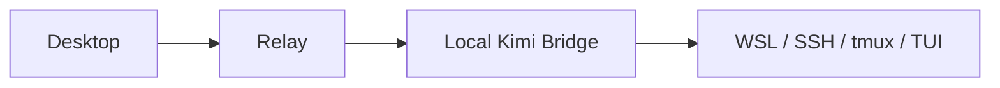
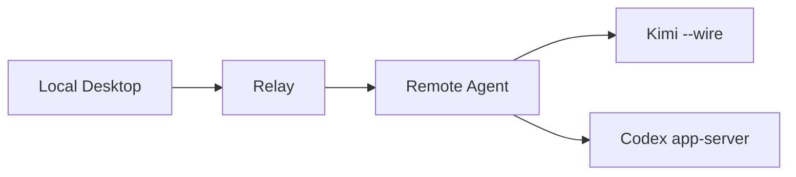

# Agent Control Plane

面向远程 AI 编码 CLI 的自托管控制平面。

`Agent Control Plane` 用于将分散在远程服务器、不同 CLI 和不同终端中的 session 状态与 approval request，统一收回到本地控制端进行查看、审批与后续控制。

## 项目状态

- 已完成阶段：`P0`、`P1`、`P1.5`、`P2`、`P2.5`、`P3`
- 当前阶段：`P4 Remote-Agent Foundation`
- 下一阶段：`P4.5 Hosted Session Usability`
- `V1` 主线：`Kimi` + `remote-agent` + `Multi-Remote` + `Codex`
- `V2` 计划：`Claude Code`

已完成里程碑：

- `P0` 项目初始化
- `P1` Relay Core
- `P1.5` Relay 收口
- `P2` Kimi 闭环
- `P2.5` Kimi bridge 收口与远端复核
- `P3` 本地控制端 MVP

当前优先事项：

- 完成远端 `remote-agent` 的基础执行边界
- 将 Kimi 执行链路从本地 bridge 迁移到远端原生执行层
- 为后续 `P4.5` 的托管 session 可用性闭环预留稳定接口与状态语义
- 保持现有 `relay`、approval 幂等规则和本地控制端 MVP 不回退

## 项目目标

本项目不以聊天 UI 或推理链可视化为目标。

本项目聚焦解决远程 AI 编码工作流中的控制面问题：

- 多个 remote 上存在多个 agent session
- 不同 CLI 的事件模型和审批机制不一致
- approval request 分散在 SSH 终端中
- 本地缺少统一的状态视图与审批入口

项目目标可以概括为：

`将远程 agent 的状态、审批与后续控制稳定地统一回收到本地。`

## V1 范围

`V1` 仅覆盖以下能力：

- 一个本地控制端
- 一个本地 `relay`
- 每台远程服务器一个 `remote-agent`
- 统一的 session 列表与 approval 列表
- 本地统一 `approve / reject`
- 多 remote 聚合
- 首批 provider：`Kimi`，随后接入 `Codex`

`V1` 明确不包含以下内容：

- `Claude Code`
- 团队协作与 RBAC
- 云中继服务
- 移动端应用
- Windows 桌宠
- macOS 灵动岛界面
- 完整推理链可视化

## Provider 策略

当前 provider 接入策略固定如下：

- `Kimi`：优先使用 `kimi --wire`
- `Codex`：优先使用 `codex app-server`
- `Claude Code`：延期至 `V2`

这意味着本项目不会继续将 `tmux + TUI` 作为长期主架构，而是优先采用 provider 原生或半原生的结构化接入面。

## 架构概览

`P3` 之前的稳定基线如下：



该基线已经证明了需求、审批流和本地控制端方向成立，但它不是长期架构。

`P4` 开始的目标架构如下：



核心职责划分：

- `relay`：负责本地聚合状态、approval 队列、snapshot 与一致性规则
- `remote-agent`：负责远端 session 生命周期、provider 原生接入和 approval writeback
- provider 相关的脆弱实现细节应尽量保留在远端，而不是留在本地主链路

已确定的架构方向：

- 本地控制端不是远端 session 的生存依赖
- 远端 `remote-agent` 必须作为 session 的真实运行宿主
- 本地程序关闭后，远端托管 session 应继续运行
- 本地程序重新打开后，应能够重新连接并恢复当前 session 与 pending approvals 视图

该能力目前尚未完全实现，但已经确定为后续阶段的正式目标。

关于远端 `remote-agent` 被终止后的恢复边界，项目当前定义如下：

- 目标是将 `remote-agent` 作为用户态服务重新拉起
- 控制平面状态应能够恢复，包括 active sessions、pending approvals 与最后已知状态
- provider 运行时是否能够从原执行现场继续，取决于 provider 是否支持 `resume` 或 `reattach`

项目不会将“服务可复活”与“agent 执行现场必然完整恢复”混为一谈。

## 当前实现基线

当前已经落地的核心能力包括：

- `relay` FastAPI 运行入口
- `GET /v1/snapshot`
- `POST /v1/approval-response`
- in-memory `session store`
- in-memory `approval store`
- 最小 `event log`
- approval 幂等保护
- approval / session 状态一致性
- 本地控制端 `desktop/`
- 单 relay session 列表
- pending approvals 列表
- 本地 `approve / reject` 提交
- relay 连接状态展示

当前稳定规则：

- `approved -> session=running`
- 相同决策重复提交：成功返回，但不重复写入事件
- 冲突决策重复提交：返回 `409`
- 先完成 provider writeback，再提交本地状态

## 当前限制

当前 `Kimi` 仍保留一条 bridge-based 基线，主要用于验证和过渡。其限制包括：

- `request_id` 仍由 adapter 派生，不是 Kimi 原生 ID
- 远端 writeback 仍依赖 `tmux` 与当前 TUI 布局
- `relay` 当前仍为 in-memory 状态
- 该链路已足以证明产品方向和审批闭环，但不应表述为生产级原生集成

`P4` 的主要工作，是将这条旧 bridge 从主使用路径中移除。

当前恢复能力仍存在明确缺口：

- `remote-agent` 的自动复活与重连恢复尚未完成
- 控制平面状态恢复与 provider 运行时恢复尚未正式落地
- 后续将“可恢复控制面”作为明确目标；provider 原始执行现场恢复将按各 provider 能力分别处理

## 平台策略

平台边界如下：

- 本地开发平台：Windows
- 本地目标平台：Windows 与 macOS
- 远程 provider 运行平台：Linux

项目从一开始即按“跨平台核心 + 平台专属外壳”设计。

跨平台核心包括：

- `relay`
- `remote-agent`
- 数据模型
- session / approval 状态机
- API
- provider 事件归一化

平台专属外壳包括：

- Windows 托盘或桌面交互壳
- macOS 菜单栏或灵动岛交互壳
- 本地通知渲染

## 路线图

`已完成`

- `P0` 项目初始化
- `P1` Relay Core
- `P1.5` Relay 收口
- `P2` Kimi 闭环
- `P2.5` Kimi bridge 收口与远端复核
- `P3` 本地控制端 MVP

`当前`

- `P4` Remote-Agent Foundation

`下一阶段`

- `P4.5` Hosted Session Usability

`P4.5` 用于将托管 session 从“已经具备 foundation”补到“可以日常使用”的最小闭环，重点包括：

- `remote-agent -> relay` 的真实状态与 approval 回传
- 最小 session CLI：
  - `remote-agent sessions`
  - `remote-agent watch <session_id>`
  - `remote-agent reply <session_id> --message "..."`
  - `remote-agent stop <session_id>`
- 增强交互入口：
  - `remote-agent attach <session_id>`
- 最小恢复契约：
  - 服务复活
  - 控制面状态恢复
  - provider 恢复边界说明

`V1 后续`

- `P5` Multi-Remote
- `P6` 跨平台清理
- `P7` Codex Support
- `P8` 可靠性增强

`V2`

- `Claude Code Support`

阶段职责说明：

- `P4`：完成远端执行边界迁移到 `remote-agent`
- `P4.5`：补齐托管 session 的日常可用性
- `P8`：落实“本地可关闭、远端持续运行、后续可重连恢复”的稳定能力
- `P8`：同时完成“服务复活、状态重建、恢复边界说明”的正式实现与正式文档化

## 仓库结构

```text
agent-control-plane/
├── README.md
├── DEV.md
├── P0_worklog.md
├── P1_worklog.md
├── P1.5_worklog.md
├── P2_worklog.md
├── P2.5_worklog.md
├── P3_worklog.md
├── logs/
├── relay/
├── adapters/
│   ├── kimi/
│   ├── claude/
│   └── codex/
├── desktop/
└── remote-agent/
```

## 维护者说明

建议维护者优先阅读以下文件：

- `README.md`
- `DEV.md`
- 各阶段 `*_worklog.md`
- `logs/当天日期.md`

其中：

- `README.md`：用于公开说明项目定位、范围和路线
- `DEV.md`：用于定义当前阶段、实现边界和维护规则

## 架构补充说明

本项目明确走向“远程托管 session 的控制平面”，而不是停留在“桌面提醒工具”或“CLI 伴侣工具”。

简要地说：

- 桌面壳更容易实现
- 托管式运行时更难实现
- 但若目标是长期平台能力，托管式运行时是更合理的架构

### 为什么不止做桌面提醒或本地壳

如果目标仅为以下能力：

- 本地查看状态
- 弹出 approval 提醒
- 为 CLI 增加辅助能力

那么一个桌面壳已经足够。

但当项目目标扩展为以下能力时，桌面壳就不再是合适的执行中心：

- 支持多个 remote
- 支持长时间运行的远端 session
- 本地控制端关闭后远端仍继续运行
- 本地恢复后可以重新连接
- 优先接入 provider 原生接口，而不是长期依赖终端抓取
- 后续扩展到实时会话控制

在这种前提下，桌面端应当是控制端，而不是运行宿主。

### 为什么引入 `remote-agent`

`remote-agent` 的作用并不是单纯新增一个服务，而是明确远端执行边界。

它的目标是保证以下三点：

1. 远端 session 的生命周期不依赖本地控制端
2. provider 的运行细节尽量保留在远端处理
3. 本地程序负责控制与展示，而不是负责托管执行

因此，项目需要从旧链路：

`desktop -> relay -> local bridge -> SSH / tmux / TUI`

迁移到长期链路：

`desktop -> relay -> remote-agent -> provider native interface`

### 为什么这条路线更适合长期发展

该路线前期成本更高，但它能够支撑项目真正需要的能力：

- 远端托管 session
- 本地断开后仍可恢复控制
- 多 remote 扩展
- provider-native 接入
- 更清晰的状态归属
- 更合理的恢复与重连语义

它也使项目的产品定义更清晰：

本项目不是单纯的桌面通知器，而是面向远程编码 agent 的自托管控制平面。

### 这条路线的代价

这不是一条最短时间内做出漂亮 UI 的路线。

其代价包括：

- 前期工程成本更高
- 恢复语义需要提前定义清楚
- 远端运行时边界需要先立住
- 阶段推进速度会慢于“桌面壳”路线

但这一代价是可接受的，因为项目最终需要解决的问题并不是“界面如何更方便”，而是：

- session 能否长期托管
- approval 能否稳定控制
- 本地断开后能否恢复
- 多个 remote 和多个 provider 能否统一收进控制平面

### 结论

本项目选择该架构，不是为了尽快做出一个桌面程序，而是为了建立一个长期可扩展、可恢复、可自托管的远程 agent 控制平面。

这条路线更重，但方向更合理。

## License

计划使用以下许可证之一：

- `MIT`
- `Apache-2.0`
