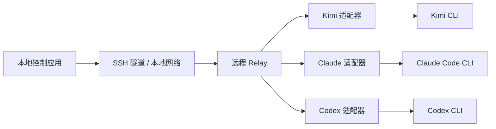

# Agent Control Plane

一个面向远程 AI 编码 CLI 的自托管控制平面。

`Agent Control Plane` 用来统一监控多个远程 agent session，并把分散在不同远程终端里的审批请求汇总到一个本地控制界面中处理。

## Status

当前状态：`P0`、`P1`、`P1.5`、`P2`、`P2.5`、`P3` 已完成，准备进入 `P4 Multi-Remote`。

已完成：
- `P0` 项目初始化
- `P1` Relay Core
- `P1.5` Relay 收口
- `P2` Kimi 闭环
- `P2.5` Kimi bridge 收口与远端复核
- `P3` 本地控制端 MVP

当前优先级：
- 推进 `P4 Multi-Remote`
- 在本地界面里聚合多个 relay snapshot
- 保持现有 `P3` 单 relay MVP 与 Kimi bridge 规则不回退

## 项目定位

这个项目不是聊天 UI，不是 IDE 插件，也不是推理链可视化工具。

它解决的是“运行控制层”的问题：
- 多个 remote 上有多个 agent 在运行
- 不同 CLI 的事件和交互方式不同
- approval request 分散在 SSH 终端里
- 本地缺少一个统一的监控和审批入口

这个项目的核心目标是：

`让远程 agent 的状态和审批请求稳定、统一地回到本地。`

## 目标 Provider

首批目标 provider：
- Kimi Code CLI
- Claude Code CLI
- Codex CLI

接入顺序：
- Kimi
- Claude
- Codex

## 核心能力

- 监控多个远程服务器
- 监控每台服务器上的多个 agent session
- 把不同 provider 的事件统一成一个共享事件模型
- 在本地统一处理 approval request
- 通过 SSH 工作流连接远程环境
- 保持核心层跨平台，避免被单一桌面系统绑定

## 当前已实现

当前 relay 基线能力：
- FastAPI 运行入口
- `GET /v1/snapshot`
- `POST /v1/approval-response`
- in-memory `session store`
- in-memory `approval store`
- 最小 `event log`
- approval 幂等保护
- approval / session 状态一致性收口

当前稳定基线规则：
- `approved -> session=running`
- 相同决策重复提交：`200` 且不重复写事件
- 冲突决策重复提交：`409`

当前已证明的 Kimi 集成能力：
- 已跑通真实远端 Kimi approval 闭环
- 已复核远端 `approve` 路径
- 已复核远端 `reject` 路径
- 已验证 remote-backed 失败 / 超时路径不会污染本地状态

当前本地控制端基线能力：
- `desktop/` 下已有最小可启动本地控制应用
- 当前桌面端最小技术栈为 `Electron + Node.js + 原生 HTML/CSS/JS`
- 已接通单 relay `GET /v1/snapshot`
- 已实现 session 列表
- 已实现 pending approvals 列表
- 已实现本地 `approve / reject` 到 relay `POST /v1/approval-response`
- 已实现单 relay 连接状态展示

## 当前集成状态

当前 Kimi 集成属于 `bridge-based integration`，不是官方协议级集成。

这意味着：
- 项目已经具备可继续向本地控制端推进的真实远端链路
- 但当前集成仍应视为工程化 bridge，而不是生产级原生集成

当前主要限制：
- `request_id` 仍由 adapter 派生，不是 Kimi 原生 ID
- remote writeback 仍依赖 `tmux` 按键和当前 TUI 布局
- `reject` 路径虽然已复核，但证据强度仍弱于完全结构化协议回执
- relay 当前仍是 in-memory 状态，没有持久化保护

## MVP 范围

第一个可用版本只包含：
- 一个本地控制应用
- 多个远程服务器
- 每台服务器多个 agent session
- 统一审批队列
- session 列表和状态视图
- approve / reject 流程

第一版统一状态只保留：
- `running`
- `waiting_approval`
- `completed`
- `failed`
- `disconnected`

## Non-Goals

V1 明确不做：
- 完整推理链可视化
- 团队协作和 RBAC
- 云中继服务
- 手机 App
- Windows 桌宠
- macOS 灵动岛界面

## 平台策略

当前平台边界：
- 本地开发平台：Windows
- 本地目标平台：Windows 和 macOS
- 远程 provider 运行平台：Linux

项目从一开始就按“跨平台核心 + 平台专属外壳”设计。

跨平台核心包括：
- `relay`
- 数据模型
- session / approval 状态机
- API
- provider 事件归一化

平台专属外壳包括：
- Windows 托盘或桌面交互壳
- macOS 菜单栏或灵动岛交互壳
- 本地通知渲染

这意味着：
- 现在可以在 Windows 本地开发
- 将来可以把本地控制端迁移到 macOS
- 与 provider CLI、PTY、shell 强相关的验证仍然需要在远程 Linux 上完成

## 架构概览



## 当前实现路线

`已完成`
- `P0` 项目初始化
- `P1` Relay Core
- `P1.5` Relay 收口
- `P2` Kimi 闭环
- `P2.5` Kimi bridge 收口与远端复核
- `P3` 本地控制端 MVP

`当前`
- `P4` Multi-Remote

`后续`
- `P5` 跨平台清理
- `P6` Claude Support
- `P7` Codex Experimental
- `P8` 可靠性增强

## 仓库结构

```text
agent-control-plane/
├── README.md
├── DEV.md
├── P0_worklog.md
├── P1_worklog.md
├── P2_worklog.md
├── P2.5_worklog.md
├── P3_worklog.md
├── logs/
│   └── 2026-03-31.md
├── relay/
├── adapters/
│   ├── kimi/
│   ├── claude/
│   └── codex/
└── desktop/
```

## Maintainers

如果你是维护者，日常开发主要看：
- `README.md`
- `DEV.md`
- `P0_worklog.md`
- `P1_worklog.md`
- `P2_worklog.md`
- `P2.5_worklog.md`
- `P3_worklog.md`
- `logs/当天日期.md`

其中：
- `README.md` 负责公开说明项目定位、范围和路线
- `DEV.md` 负责解释当前阶段、派工方式和下一步

## License

计划使用：
- `MIT`
或
- `Apache-2.0`
