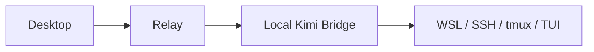
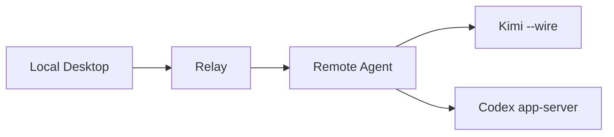

# Agent Control Plane

面向远程 AI 编码 CLI 的自托管控制平面。

`Agent Control Plane` 用于将分散在远程服务器、不同 CLI 和不同终端中的 session 状态、approval request 与后续交互，统一收回到本地控制端进行查看、审批与继续控制。

## 项目状态

- 已完成阶段：`P0`、`P1`、`P1.5`、`P2`、`P2.5`、`P3`、`P4`、`P4.5`、`P5`、`P6`、`P6.5`
- 当前节点：`P7-B Desktop Reply Submission And Relay Session Interaction Route`
- 已完成节点：`P7-A Desktop Session Detail And Transcript`
- 下一节点：`P8 V1.0 Release`

- `V1` 主线：`Kimi` + `remote-agent` + `Multi-Remote` + `Local Session Interaction UI`
- `V2` 计划：`Claude Code`

已完成里程碑：

- `P0` 项目初始化
- `P1` Relay Core
- `P1.5` Relay 收口
- `P2` Kimi 闭环
- `P2.5` Kimi bridge 收口与远端复核
- `P3` 本地控制端 MVP
- `P4` Remote-Agent Foundation
- `P4.5` Hosted Session Usability
- `P5` Multi-Remote
- `P6` 跨平台清理

当前优先事项：

- 推进 `P7 Local Session Interaction UI`
- 在不改变托管平台架构的前提下，让本地 `desktop` 可以查看 hosted session 内容并继续交互
- 保持 `P5` 已完成的多 remote 基线稳定，不回退为单 remote 视角
- 保持 `P4` 与 `P4.5` 已完成链路稳定，不回退到旧 bridge 主路径
- 保持 recovery 相关表述继续遵循当前 contract-only 边界，不把未实现恢复系统写成已支持

`P5` 当前已具备：

- `relay` 内的 multi-remote server registry
- 以 `remote_id + request_id` 唯一定位的 approval identity；单 remote 下保留 `request_id` 兼容用法
- desktop 对 `snapshot.servers` 的 multi-remote 展示与按 `remote_id` 分组的 session / approval 视图
- `connected / disconnected / unreachable` 最小 remote 状态标记

`P5` 当前未做：

- reconnect 体系
- 持久化与跨重启 rehydrate
- pending approvals replay
- 控制面事件 replay
- provider 执行现场恢复

这些能力仍保留在正式 `v1.0` 之后的可靠性增强阶段，尤其是 `P10`，不应被误写为 `P5` 已落地。

## 项目目标

本项目当前不以通用聊天 UI 或推理链可视化作为主目标，但本地控制端必须具备对已托管 session 的基础交互能力。

当前版本聚焦解决远程 AI 编码工作流中的控制面问题：

- 多个 remote 上存在多个 agent session
- 不同 CLI 的事件模型和审批机制不一致
- approval request 分散在 SSH 终端中
- 本地缺少统一的状态视图与审批入口

项目目标可以概括为：

`将远程 agent 的状态、审批与后续交互稳定地统一回收到本地。`

## V1 范围

`V1` 仅覆盖以下能力：

- 一个本地控制端
- 一个本地 `relay`
- 每台远程服务器一个 `remote-agent`
- 统一的 session 列表与 approval 列表
- 本地 session 详情与最近回复查看
- 本地对已托管 session 的 `reply` 交互
- 本地统一 `approve / reject`
- 多 remote 聚合
- 首个正式 provider：`Kimi`

`V1` 明确不包含以下内容：

- `Claude Code`
- 团队协作与 RBAC
- 云中继服务
- 移动端应用
- Windows 桌宠
- macOS 灵动岛界面
- 完整推理链可视化

## Provider 策略

当前 provider 接入策略固定如下：

- `Kimi`：优先使用 `kimi --wire`
- `Codex`：后移至 `P9`
- `Claude Code`：延期至 `V2`

这意味着本项目不会继续将 `tmux + TUI` 作为长期主架构，而是优先采用 provider 原生或半原生的结构化接入面。

## 架构概览

`P3` 之前的稳定基线如下：



该基线已经证明了需求、审批流和本地控制端方向成立，但它不是长期架构。

`P4` 开始的目标架构如下：



核心职责划分：

- `relay`：负责本地聚合状态、approval 队列、snapshot 与一致性规则
- `remote-agent`：负责远端 session 生命周期、provider 原生接入和 approval writeback
- provider 相关的脆弱实现细节应尽量保留在远端，而不是留在本地主链路
- `remote-agent` 直接连接 provider worker；`relay` 仅承载本地控制面所需的状态聚合、审批信令与事件转发，不代理 provider 原始模型数据流
- 恢复与检查点能力将建立在现有 `session registry / state store` 上扩展，而不是引入新的顶层控制面架构

已确定的架构方向：

- 本地控制端不是远端 session 的生存依赖
- 远端 `remote-agent` 必须作为 session 的真实运行宿主
- 本地程序关闭后，远端托管 session 应继续运行
- 本地程序重新打开后，应能够重新连接并恢复当前 session 与 pending approvals 视图

该能力目前尚未完全实现，但已经确定为后续阶段的正式目标。

关于远端 `remote-agent` 被终止后的恢复边界，项目当前定义如下：

- 目标是将 `remote-agent` 作为用户态服务重新拉起
- 控制平面状态应能够恢复，包括 active sessions、pending approvals 与最后已知状态
- provider 运行时是否能够从原执行现场继续，取决于 provider 是否支持 `resume` 或 `reattach`

项目不会将“服务可复活”与“agent 执行现场必然完整恢复”混为一谈。

## 当前实现基线

当前已经落地的核心能力包括：

- `relay` FastAPI 运行入口
- `GET /v1/snapshot`
- `POST /v1/approval-response`
- in-memory `session store`
- in-memory `approval store`
- 最小 `event log`
- approval 幂等保护
- approval / session 状态一致性
- `remote-agent serve`
- 远端 `systemctl --user` 长驻运行
- `remote-agent kimi start --task "..."` 通过 `kimi --wire` 启动 hosted session
- `remote-agent sessions / watch / reply / stop`
- `remote-agent -> relay` 标准事件上报
- `relay -> remote-agent -> kimi --wire` 的 approval decision / writeback 主链路
- 本地控制端 `desktop/`
- 单 relay session 列表
- pending approvals 列表
- 本地 `approve / reject` 提交
- relay 连接状态展示
- 远端 shell 中的 `reply` 可继续与 hosted session 交互

当前稳定规则：

- `approved -> session=running`
- 相同决策重复提交：成功返回，但不重复写入事件
- 冲突决策重复提交：返回 `409`
- 先完成 provider writeback，再提交本地状态

## 当前限制

旧 `Kimi bridge` 仍保留一条 bridge-based 基线，主要用于历史验证和过渡，不再是当前主路径。其限制包括：

- `request_id` 仍由 adapter 派生，不是 Kimi 原生 ID
- 远端 writeback 仍依赖 `tmux` 与当前 TUI 布局
- `relay` 当前仍为 in-memory 状态
- 该链路已足以证明产品方向和审批闭环，但不应表述为生产级原生集成

`P4` 与 `P4.5` 收口后的当前边界主要在：

- `attach` 尚未实现
- Recovery 实现尚未正式落地
- 本地 `desktop` 当前仍只覆盖控制面，不显示 hosted session 的回复内容，也不能从 UI 提交 `reply`

当前 hosted session 的已知边界包括：

- `sessions` 仅展示当前 `remote-agent` 进程内仍托管的 session，不是持久化历史视图
- `watch` 当前是单次读取最新状态，不是持续 follow
- `reply` 当前是非 `attach` 模式下对已托管 session 追加一轮输入
- `stop` 当前只允许用于非运行中、且不处于 `approval_pending` 的 session
- `approval_pending` 下拒绝 `stop`，以避免远端托管状态与 `relay` 的 pending approval 语义分叉
- `attach` 当前未实现，不应表述为已支持

当前恢复能力仍存在明确缺口：

- `remote-agent` 目前只有“服务可通过 `systemctl --user` 复活”的能力，还没有“进程重启后自动恢复 hosted session 内存态”的能力
- `relay` 当前仍是 in-memory store；重启后不会自动恢复已有 session / pending approvals / control metadata
- 当前还没有正式的 checkpoint 持久化、pending approvals replay 或控制面事件 replay
- 后续将“可恢复控制面”作为明确目标；provider 原始执行现场恢复将按各 provider 能力分别处理

## 首次公开 Beta 发布面

`P6.5-1`、`P6.5-2`、`P6.5-3`、`P6.5-4`、`P6.5-5`、`P6.5-6` 与 `P6.5-7` 已完成，
并已将第一次公开 Beta 固定为面向技术试用者的最小 source-run Beta，而不是带
installer 的完整桌面产品。
`P6.5` 已整体完成；当前阶段已切换为 `P7 Local Session Interaction UI`。

本次 Beta 包含：

- 一个本地 `relay`
- 一个本地 `desktop`
- 每台远端 Linux 主机一个 `remote-agent`
- `Kimi --wire`
- hosted session CLI：`start / sessions / watch / reply / stop`
- multi-remote 聚合基线

本次 Beta 明确不包含：

- `Codex`
- `Claude Code`
- `attach`
- reconnect / 持久化 / replay / `P10` 可靠性增强系统
- 云 relay
- desktop installer
- `remote-agent` 的 PyPI 包、wheel 发布或系统发行包

最小启动路径：

1. 在本地启动 `relay`
2. 在同一台本地机器启动 `desktop`，默认连接 `http://127.0.0.1:8000`
3. 在每台远端 Linux 主机上部署 `remote-agent`
4. 为远端服务显式配置 `REMOTE_AGENT_RELAY_ENDPOINT` 与
   `REMOTE_AGENT_CONTROL_BASE_URL`；多 remote 试用建议同时设置
   `REMOTE_AGENT_REMOTE_NAME`
5. 在远端执行 `remote-agent kimi start --task "..."`
6. 在本地 `desktop` 中查看 session / approval 并执行 `approve / reject`

交付形态：

- `desktop`：以 repo 内 `desktop/` 源码目录交付，当前口径是
  `npm install && npm start`，不是 installer
- `remote-agent`：以 repo 内 `remote-agent/` Python 包源码与
  `systemd --user` 安装脚本交付，不是独立安装包
- `relay`：作为本地 operator-run FastAPI 进程交付，是 Beta 必需组件，
  不是云服务，也不是单独托管产品

desktop 首发交付基线：

- 交付形态：首发公开 Beta 只交付 repo 内 `desktop/` 源码目录，保持
  source-run，不额外产出 installer、独立 exe 或签名分发包
- 启动命令：`cd desktop`、`npm install`、`npm start`
- 最小依赖：本地 Windows、Node.js 与 npm、仓库副本，以及一个已启动且
  可访问的本地 `relay`
- relay 连接假设：`desktop` 当前只连一个 relay；默认目标是
  `http://127.0.0.1:8000`，需要覆盖时通过 `RELAY_BASE_URL` 显式指定；
  `desktop` 不负责自动拉起 `relay`
- 额外打包要求：首发公开 Beta 当前不要求额外打包；`desktop/package.json`
  当前只有 `start` 与 `dev` 运行脚本，没有正式 build / package 交付面
- source-run 当前可接受的原因：首发公开 Beta 面向技术试用者，当前优先验证
  本地控制面、multi-remote 视图与 approval 流程，而不是提前承诺 installer、
  签名、自动更新与平台分发体验
- desktop 当前不承诺：installer、MSI/EXE 安装包、代码签名、自动更新、
  打包后单文件分发、内置 relay 引导启动

remote-agent 首发试用安装基线：

- 交付形态：首发公开 Beta 继续交付 repo 内 `remote-agent/` 源码目录、
  `deploy/` 模板与 `scripts/install-systemd-user.sh`，保持 source-install
- 远端安装方式：将 `remote-agent/` 目录放到远端 Linux 主机后执行
  `bash scripts/install-systemd-user.sh --start`
- `systemd --user` 启动方式：首发试用仍以 user service 为唯一正式长期运行面；
  常用命令是 `systemctl --user start/stop/restart/status remote-agent.service`
- 已提供的安装/启动帮助：
  - 安装脚本会创建 venv、执行 `python -m pip install -e <workdir>`、
    写入基础 env、渲染 service 文件、`daemon-reload`、`enable`，
    并在 `--start` 下启动服务
  - 仓库已提供 env example、service template 与 install script
- 仍需试用者手工完成：
  - 在 `~/.config/remote-agent/remote-agent.env` 中补充
    `REMOTE_AGENT_RELAY_ENDPOINT`
  - 补充 `REMOTE_AGENT_CONTROL_BASE_URL`
  - 建议补充 `REMOTE_AGENT_REMOTE_NAME`
  - 确认本地 `relay` 可从远端访问，且本地 `relay` 可回连远端控制地址
- 必需环境变量：
  - 脚本自动写入：`REMOTE_AGENT_HOST`、`REMOTE_AGENT_PORT`、
    `REMOTE_AGENT_LOG_LEVEL`、`REMOTE_AGENT_LOG_FILE`
  - 试用者手工补充：`REMOTE_AGENT_RELAY_ENDPOINT`、
    `REMOTE_AGENT_CONTROL_BASE_URL`
  - multi-remote 试用建议手工补充：`REMOTE_AGENT_REMOTE_NAME`
- Kimi provider binary 发现方式：
  - 默认依赖 PATH 中可执行的 `kimi`
  - 非 PATH 安装时，显式设置 `KIMI_BIN`，或在启动命令中传
    `--kimi-bin`
- 最小验证命令：
  - `systemctl --user status remote-agent.service --no-pager`
  - `remote-agent sessions`
  - `remote-agent kimi start --task "..." [--kimi-bin ...]`
  - `tail -n 50 ~/.local/state/remote-agent/remote-agent.log`
- remote-agent 当前不承诺：一键全自动安装、自动写完 relay/control env、
  非 Linux deploy 面、PyPI 包、系统发行包、provider 恢复系统

最小试用前提：

- 试用者需要能操作 Python、npm、SSH 与 `systemd --user`
- 本地需要能运行 Python 与 Node.js / npm
- 远端 Linux 需要可用的 `python3`、`systemctl --user`、`loginctl`
  与 logout-survival 所需的 linger 能力
- 远端需要已安装可执行 `kimi --wire` 的 `kimi`，或显式提供 `KIMI_BIN`
- 每台远端都必须能访问本地 `relay`，本地 `relay` 也必须能访问每台远端
  `remote-agent` 的控制地址

当前公开 Beta 已知限制：

- 远端 `remote-agent` 试用当前仍需要手工补充 relay / control 相关环境变量
- `install-systemd-user.sh` 当前只自动写基础 host / port / log env，不自动完成
  relay / control / remote-name 试用配置
- `watch` 不是持续 follow
- `attach` 未实现
- `stop` 不能在 `approval_pending` 或 turn 运行中执行
- `relay` 与 `remote-agent` 都还是内存态；重启后不会恢复既有托管状态
- 当前发布面是 source-run / source-install Beta，不是开箱即用 installer Beta

## 平台策略

平台边界如下：

- 本地开发平台：Windows
- 本地产品目标平台：Windows 与 macOS
- 远程 provider 运行平台：Linux

首次公开 Beta 支持矩阵如下：

| Surface | Platform | 首次公开 Beta 状态 | 说明 |
| --- | --- | --- | --- |
| 本地 `desktop + relay` | Windows | 支持 | 当前按 repo source-run 交付 |
| 本地 `desktop + relay` | macOS | 不纳入首发承诺 | `P6` 已做跨平台清理，但本次 Beta 不把 macOS 写成已交付 |
| 本地 `desktop + relay` | Linux | 不包含 | 不属于当前本地目标平台 |
| 远端 `remote-agent` | Linux | 支持 | 需 `systemd --user`、`loginctl` 与 linger |
| 远端 `remote-agent` | Windows / macOS | 不包含 | 当前没有对应 deploy 面 |
| provider | `Kimi --wire` | 支持 | 本次公开 Beta 唯一正式 provider |
| provider | `Codex` / `Claude Code` | 不包含 | 分别后移到 `P9` 与 `V2` |

项目从一开始即按“跨平台核心 + 平台专属外壳”设计。

跨平台核心包括：

- `relay`
- `remote-agent`
- 数据模型
- session / approval 状态机
- API
- provider 事件归一化

平台专属外壳包括：

- Windows 托盘或桌面交互壳
- macOS 菜单栏或灵动岛交互壳
- 本地通知渲染

## 首发公开 Beta 最小 Quick Start

这一节只定义第一次公开 Beta 的最小试用路径。它面向技术试用者，
默认你接受 source-run / source-install 与手工 env 配置；它不是
installer runbook。

文档分层如下：
- 根 README：给出整条最小试用路径
- `desktop/README.md`：只展开本地 Windows 侧职责
- `remote-agent/README.md`：只展开远端 Linux 安装与启动面
- `P6.5_trial_guide.md`：面向 2-5 人小范围试用组织者的讲解顺序、演示任务与反馈收集
- `P6.5_release_notes.md`：面向外部试用者的最小 release notes
- `P6.5_launch_checklist.md`：发布前检查项，避免误说成已支持的能力

### 1. 本地准备

本地机器当前固定为 Windows，至少需要：
- Python `3.10+`
- Node.js 与 npm
- 当前仓库副本
- 一个能从远端 Linux 访问到的本地 `relay` 地址

### 2. 本地启动 relay

在 repo 根目录执行：

```powershell
python -m pip install -r requirements-relay.txt
python -m uvicorn relay.main:app --host 127.0.0.1 --port 8000
```

可选自检：

```powershell
curl.exe http://127.0.0.1:8000/v1/snapshot
```

这一步只会启动本地 `relay`。它不会自动启动 `desktop`，也不会替你配置
任何远端 `remote-agent`。

### 3. 本地启动 desktop

打开第二个本地 shell：

```powershell
cd desktop
npm install
npm start
```

当前 `desktop` 默认连接 `http://127.0.0.1:8000`。如果你的本地 `relay`
不在这个地址上，用 `RELAY_BASE_URL` 显式覆盖。首发公开 Beta 中，
`desktop` 只负责观察 session / approval 并提交 `Approve` / `Reject`，
不会自动拉起 `relay`。

### 4. 远端 Linux 安装并启动 remote-agent

把 `remote-agent/` 目录放到远端 Linux 主机后执行：

```bash
cd ~/agent-control-plane/remote-agent
bash scripts/install-systemd-user.sh --start
```

当前脚本只会自动完成：
- 创建 venv
- `pip install -e <workdir>`
- 写基础 host / port / log env
- 渲染并启用 `systemd --user` service

它不会自动写完 `relay` / `control` / `remote-name` 相关配置。

### 5. 手工补充远端 env

打开远端 `~/.config/remote-agent/remote-agent.env`，至少补充：

```bash
REMOTE_AGENT_RELAY_ENDPOINT=http://<local-relay-host>:8000
REMOTE_AGENT_CONTROL_BASE_URL=http://<remote-host>:8711
REMOTE_AGENT_REMOTE_NAME=<unique-remote-id>
```

说明：
- `REMOTE_AGENT_RELAY_ENDPOINT` 必须从远端 Linux 可访问
- `REMOTE_AGENT_CONTROL_BASE_URL` 必须从本地 `relay` 可回连
- `REMOTE_AGENT_REMOTE_NAME` 对 multi-remote 试用强烈建议显式设置

### 6. 手工确认网络互通

在远端 Linux 上确认能访问本地 `relay`：

```bash
curl http://<local-relay-host>:8000/v1/snapshot
```

在本地 Windows 上确认能访问远端 `remote-agent` 控制面：

```powershell
curl.exe http://<remote-host>:8711/healthz
```

这些检查在首发公开 Beta 中仍是手工步骤，不是安装脚本已自动完成的内容。

### 7. 检查 `Kimi --wire`

在远端 Linux 上执行：

```bash
which kimi
kimi info
```

当前 `remote-agent` 会按以下顺序发现 `Kimi`：
1. `remote-agent kimi start --kimi-bin ...`
2. `KIMI_BIN`
3. PATH 中的 `kimi`

如果 `kimi` 不在 PATH 中，不要把它写成“已自动发现”；要么手工设置
`KIMI_BIN`，要么在启动命令里显式传 `--kimi-bin`。

### 8. 启动一次远端 hosted session

建议先进入一个远端测试目录，再启动一个更可能触发 approval 的任务：

```bash
mkdir -p ~/acp-beta-trial
cd ~/acp-beta-trial
remote-agent kimi start --task "Create a file named beta-proof.txt in the current directory, but ask for approval before you write anything."
```

如果 `kimi` 不在 PATH：

```bash
remote-agent kimi start --kimi-bin /path/to/kimi --task "Create a file named beta-proof.txt in the current directory, but ask for approval before you write anything."
```

随后可在远端继续验证：

```bash
remote-agent sessions
tail -n 50 ~/.local/state/remote-agent/remote-agent.log
```

当前 contract 下，`remote-agent kimi start --task "..."` 只等待首个
checkpoint 后返回；这个 checkpoint 可能是“本轮完成”，也可能是“出现
approval request”。

### 9. 在 desktop 中观察 session / approval

保持本地 `desktop` 打开，观察：
- session 列表里是否出现新的 hosted session
- pending approvals 列表里是否出现待处理请求

当前 UI 中，每条 approval 都暴露 `Approve` 与 `Reject` 按钮。

### 10. 完成一次 approve / reject

在本地 `desktop` 的 pending approvals 列表里：
- 点击 `Approve`，验证决策会经 `relay` 回写到对应远端 session
- 或点击 `Reject`，验证拒绝决策会沿同一路径回写

如果这次任务没有触发 approval，而是直接跑到首个 checkpoint 并返回，
说明链路本身可能已通，但这次任务不适合作为 approval 演示。此时应重新
执行 `remote-agent kimi start --task "..."`，换成一个更可能触发写操作或
其他受控动作的任务，而不是把“没有 approval”误写成桌面链路故障。

### 当前仍需显式写出的手工边界

- 本地 `relay` 仍需手工启动
- `desktop` 仍是 source-run，不是 installer
- 远端 `remote-agent` 仍需手工补 env
- 本地与远端的网络互通仍需手工确认
- approval 演示依赖于任务本身是否真的触发 provider 的审批点
- 当前没有 `attach`
- 当前没有持久化恢复、replay 或 `P8` 级恢复系统

## 路线图

`已完成`

- `P0` 项目初始化
- `P1` Relay Core
- `P1.5` Relay 收口
- `P2` Kimi 闭环
- `P2.5` Kimi bridge 收口与远端复核
- `P3` 本地控制端 MVP
- `P4` Remote-Agent Foundation
- `P4.5` Hosted Session Usability
- `P5` Multi-Remote
- `P6` 跨平台清理

`当前`

- `P7` Local Session Interaction UI

`后续`

- `P8` V1.0 Release
- `P9` Codex Support
- `P10` 可靠性增强

`P4.5` 用于将托管 session 从“已经具备 foundation”补到“可以日常使用”的最小闭环，重点包括：

- `remote-agent -> relay` 的真实状态与 approval 回传
- 最小 session CLI：
  - `remote-agent sessions`
  - `remote-agent watch <session_id>`
  - `remote-agent reply <session_id> --message "..."`
  - `remote-agent stop <session_id>`
- 增强交互入口：
  - `remote-agent attach <session_id>`
- 最小恢复契约：
  - Local Desktop 断开后的 session 存活语义
  - 最小 checkpoint 保存与恢复语义
  - pending approvals 与控制面事件 replay 语义
  - 服务复活
  - 控制面状态恢复
  - provider 恢复边界说明

`P4.5` 已完成，但其 recovery 部分当前仍是 contract-only 收口：

- 已经写清恢复边界与最小 checkpoint / replay 契约
- 还没有实现 checkpoint 持久化、pending approvals replay、控制面事件 replay 或 provider 执行现场恢复
- 这些恢复实现工作继续留在后续可靠性阶段，而不是被误写成 `P4.5` 已落地能力

在此基础上，`P5 Multi-Remote`、`P6 跨平台清理` 与 `P6.5 Public Beta Release` 也已完成，当前阶段切换为 `P7 Local Session Interaction UI`。

`P6.5 Public Beta Release` 插在 `P6` 与 `P7` 之间，用于完成首次公开可试用版本所需的最小封装与发布准备，重点包括：

- Desktop 的最小可运行交付形态
- `remote-agent` 的最小安装与启动封装
- Quick Start、平台支持矩阵与已知限制
- 面向外部试用者的 release notes、issue 模板与试用讲解说明

`P6.5` 的定位是公开 Beta 发布，而不是 `Codex` 接入后的完整正式版本。
`P6-1`、`P6-2` 与 `P6-3` 已全部完成，`P6.5` 也已完成；当前主线从公开 Beta 前推到本地会话交互 UI。

`P7 Local Session Interaction UI` 是当前正式阶段，用于补齐本地控制端对 hosted session 的基础交互，而不是继续只依赖远端 shell。其重点包括：

- desktop session detail / transcript view
- 本地查看最近一轮 hosted session 的回复内容
- 本地对已托管 session 提交 `reply`
- 让 session 状态、approval 与后续交互在本地控制端形成同一条闭环

当前阶段拆分为：

- `P7-A` 已完成：`Desktop Session Detail And Transcript`
- `P7-B` 当前目标：`Desktop Reply Submission And Relay Session Interaction Route`

`P7` 明确不要求：

- `attach`
- 通用聊天工作台
- 推理链可视化
- provider 原始 token 流直接透传到 `relay`

当前 hosted session contract 约定如下：

- `remote-agent kimi start --task "..."` 的语义是创建后台托管 session；命令本身只等待首个 checkpoint，达到“本轮完成”或“出现 approval”后返回，不把后续 session 绑定在当前 shell
- `remote-agent sessions` 展示的是当前 `remote-agent` runtime 内的托管 session 列表，不是历史记录
- `remote-agent watch <session_id>` 当前是单次读取最新状态，不是持续 follow；需要刷新时应再次执行命令
- `remote-agent reply <session_id> --message "..."` 是非 `attach` 模式下对同一 hosted session 追加一轮输入
- `remote-agent stop <session_id>` 当前终止 hosted session，并将其从当前 runtime 列表中移除；停止后该 session 不再出现在 `sessions` 中，`watch` 会返回未找到
- `remote-agent stop <session_id>` 当前不支持在 `approval_pending` 下执行，也不支持在一轮 turn 正在运行时执行
- `remote-agent attach <session_id>` 当前未实现；文档和实现都不应把它表述为已支持能力

当前 recovery contract 约定如下：

- 必须明确区分三层能力：
  - 服务复活：`systemd --user` 将 `remote-agent serve` 重新拉起
  - 控制面状态恢复：session / approval / snapshot / 事件视图被重新建立
  - provider 执行现场恢复：provider 子进程原执行现场被继续、重接或恢复
- Local Desktop 断开、关闭或崩溃后，远端 hosted session 的当前存活语义是：只要远端 `remote-agent serve` 与其 provider 子进程仍存活，session 继续运行；Desktop 不是 session 宿主
- Local Desktop 重新打开后的当前承诺是：它只能重新连接 `relay` 并读取 `relay` 当下仍持有的 snapshot；Desktop 自身不持有 hosted session，也不负责 provider 现场恢复
- `online / offline / awaiting_reconnect` 是 recovery 目标契约里的状态词汇，不是当前已经稳定暴露的 snapshot 字段；当前文档不能把它们写成既有 API
- 最小 checkpoint 结构当前是目标契约，不是现有持久化实现；后续至少应包含：最近会话上下文、当前工作目录、待审批项、时间戳、客户端连接标识
- pending approvals 的当前语义是：approval 对外仍使用 `request_id`，但在 multi-remote 下必须结合 `remote_id + request_id` 才能唯一定位；pending 状态只存在于当前 `relay` 内存态与 `remote-agent` 进程内存态；任一侧重启后都没有自动恢复或 replay 承诺
- 控制面事件的当前语义是：`remote-agent` 只向 `relay` 发送实时标准事件，事件带顺序信息，但当前没有持久化 event buffer，也没有跨重启 replay 机制
- `remote-agent` 服务复活后的当前承诺仅限于：服务可被重新拉起并重新接受新请求；当前不承诺恢复此前 hosted session、`request_id -> session_id` 映射、pending approvals 或 provider 子进程现场
- `relay` 重启后的当前承诺仅限于：重新开始接收新的 session / approval / event；当前不承诺从自身恢复旧 snapshot，也不承诺自动向远端拉取历史状态
- provider 子进程异常退出后的当前边界是：远端 hosted session 可能失败或消失；当前不承诺对 Kimi 原始执行现场做完整 `resume / reattach`
- 项目当前明确不把“服务能起来”表述成“控制面状态已恢复”或“provider 执行现场一定完整恢复”

`V1 后续`

- `P6.5` Public Beta Release
- `P7` Local Session Interaction UI
- `P8` V1.0 Release
- `P9` Codex Support
- `P10` 可靠性增强

`V2`

- `Claude Code Support`

阶段职责说明：

- `P4`：完成远端执行边界迁移到 `remote-agent`
- `P4.5`：补齐托管 session 的日常可用性
- `P5`：把单 remote 控制面扩展成多 remote 聚合控制面
- `P6`：清理跨平台硬编码与平台耦合，收稳 `P5` 的聚合底座
- `P6-1`：先盘清仓库内仍然存在的 Windows / PowerShell / 路径 / 编码 / 平台 API 假设，明确阻塞项与最小清理落点
- `P6-2`：先收口运行入口、文档命令面与仓库文本策略，再进入后续模块边界清理
- `P6-3`：继续收口模块边界，保持 Linux deploy 壳层与 desktop 平台壳层不回流到共享核心
- `P6.5`：完成首次公开 Beta 发布准备，封装当前 `Kimi + remote-agent + desktop + Multi-Remote` 最小可试用交付
- `P7`：补齐本地控制端对 hosted session 的基础交互，包括 session detail、最近回复展示与本地 `reply` 提交
- `P8`：以当前 `Kimi + remote-agent + Multi-Remote + Local Session Interaction UI` 为范围，完成正式 `v1.0` 发布收口
- `P9`：接入第二个正式 provider：`Codex`
- `P10`：落实更完整的恢复、checkpoint、replay 与可靠性增强

`P6-3` 当前固定边界：

- Linux deploy 壳层继续留在 `remote-agent/deploy/` 与 `remote-agent/scripts/`
- desktop 平台分支继续留在 `desktop/main.js` 这类壳层入口
- `relay/` 与 `remote-agent/src/remote_agent/` 不继续吸收 `systemctl`、`/bin/bash`、`loginctl`、Linux home 路径等 deploy 假设
- `desktop/preload.js`、renderer 与 state 不继续吸收 macOS / Windows 平台分支

`P6` 已完成；上述边界作为进入 `P6.5 Public Beta Release` 前的固定底座继续保留。

## 仓库结构

```text
agent-control-plane/
├── README.md
├── DEV.md
├── P0_worklog.md
├── P1_worklog.md
├── P1.5_worklog.md
├── P2_worklog.md
├── P2.5_worklog.md
├── P3_worklog.md
├── P4_worklog.md
├── P4.5_worklog.md
├── P5_worklog.md
├── logs/
├── relay/
├── adapters/
│   ├── kimi/
│   ├── claude/
│   └── codex/
├── desktop/
└── remote-agent/
```

## 当前 Runbook 口径

以下命令使用 repo-relative 路径，不绑定固定本机目录。
除非另有说明，默认先在仓库根目录执行。
如果使用虚拟环境，请先按当前 shell 的方式激活；文档不再写死某一个 shell 的激活命令。

### relay

```text
python -m pip install -r requirements-relay.txt
python -m uvicorn relay.main:app --host 127.0.0.1 --port 8000
```

### desktop

```text
cd desktop
npm install
npm start
```

首发公开 Beta 的 desktop 交付基线保持 source-run；当前没有额外
build / package / installer 步骤。
桌面端的最小交付说明见 `desktop/README.md`。

默认 `desktop` 读取 `http://127.0.0.1:8000`；如需覆盖，可设置
`RELAY_BASE_URL`。

### remote-agent

本地开发或调试 CLI：

```text
python -m pip install -e ./remote-agent
remote-agent serve
remote-agent kimi start --task "..."
remote-agent sessions
```

非 PATH 安装的 `kimi` 应通过 `KIMI_BIN` 或 `remote-agent kimi start --kimi-bin ...` 显式指定；共享 runtime 不再默认探测 Linux home 路径下的 provider 二进制。

首次公开 Beta 试用时，远端服务 env 至少还需要显式补充：

```text
REMOTE_AGENT_RELAY_ENDPOINT=http://<local-relay-host>:8000
REMOTE_AGENT_CONTROL_BASE_URL=http://<remote-host>:8711
REMOTE_AGENT_REMOTE_NAME=<unique-remote-id>
```

其中：

- `REMOTE_AGENT_RELAY_ENDPOINT` 用于让远端把标准事件上报回本地 `relay`
- `REMOTE_AGENT_CONTROL_BASE_URL` 必须是本地 `relay` 可回连的远端控制地址；
  不应保留为默认的 `127.0.0.1`
- `REMOTE_AGENT_REMOTE_NAME` 建议在 multi-remote 试用时显式设置，避免展示名随主机环境漂移

远端 Linux deploy 壳层继续留在 `remote-agent/deploy/` 与 `remote-agent/scripts/`，当前部署口径仍是从已部署的 repo 副本进入 `remote-agent/` 目录后执行：

```text
cd remote-agent
bash scripts/install-systemd-user.sh --start
```

当前 install script 已提供的帮助：

- 创建 venv
- 从当前 workdir 执行 `python -m pip install -e`
- 写入基础 host / port / log env
- 渲染 `systemd --user` service 文件
- 执行 `daemon-reload`、`enable`，并在 `--start` 时启动服务

当前仍需试用者手工完成：

- 补充 `REMOTE_AGENT_RELAY_ENDPOINT`
- 补充 `REMOTE_AGENT_CONTROL_BASE_URL`
- 建议补充 `REMOTE_AGENT_REMOTE_NAME`
- 确认远端到本地 relay、以及本地 relay 到远端 control base URL 的连通性
- 确认 `kimi` 已在 PATH 中，或显式配置 `KIMI_BIN`

最小验证命令：

```text
systemctl --user status remote-agent.service --no-pager
remote-agent sessions
remote-agent kimi start --task "..."
tail -n 50 ~/.local/state/remote-agent/remote-agent.log
```

remote-agent 试用安装面的最小说明见 `remote-agent/README.md`。
如果这次不是自助试用，而是由本地 operator 带 2-5 人跑通一次真实演示，请直接使用
`P6.5_trial_guide.md`。

## 首发公开 Beta 反馈入口

首发公开 Beta 的反馈入口固定为 repo issues 下的最小模板集，而不是正式 support
流程。试用结束后，请按问题类型使用 `.github/ISSUE_TEMPLATE/` 下的模板：

- `bug_report.md`
  - 用于具体故障、行为回退、approval / session 流异常
- `trial_feedback.md`
  - 用于 operator / remote trial user / observer 的试用体验反馈
- `environment_setup.md`
  - 用于环境、安装、网络可达性与版本信息记录；可单独提交，也可从 bug / feedback
    issue 中引用

当前模板字段与 `P6.5_trial_guide.md` 对齐，至少收集：

- 角色：`operator` / `remote trial user` / `observer`
- 本地平台、远端平台
- Python / Node / `kimi` 发现方式
- 是否跑到 session 出现
- 是否跑到 approval 出现
- `Approve` / `Reject` 是否成功
- 卡在哪一步
- 相关命令与日志片段
- 最小复现路径

## 首发公开 Beta Release Notes And Launch Checklist

首发公开 Beta 的对外表述与发布前检查项分别固定在：

- `P6.5_release_notes.md`
- `P6.5_launch_checklist.md`

使用规则：

- 对外介绍这次 Beta 时，以 `P6.5_release_notes.md` 为准
- 发布前自查是否误写 installer、`Codex`、`Claude Code`、`attach`、恢复能力或
  非当前平台支持时，以 `P6.5_launch_checklist.md` 为准

## 维护者说明

建议维护者优先阅读以下文件：

- `README.md`
- `DEV.md`
- 各阶段 `*_worklog.md`
- `logs/当天日期.md`

其中：

- `README.md`：用于公开说明项目定位、范围和路线
- `DEV.md`：用于定义当前阶段、实现边界和维护规则

## 架构补充说明

本项目明确走向“远程托管 session 的控制平面”，而不是停留在“桌面提醒工具”或“CLI 伴侣工具”。

简要地说：

- 桌面壳更容易实现
- 托管式运行时更难实现
- 但若目标是长期平台能力，托管式运行时是更合理的架构

### 为什么不止做桌面提醒或本地壳

如果目标仅为以下能力：

- 本地查看状态
- 弹出 approval 提醒
- 为 CLI 增加辅助能力

那么一个桌面壳已经足够。

但当项目目标扩展为以下能力时，桌面壳就不再是合适的执行中心：

- 支持多个 remote
- 支持长时间运行的远端 session
- 本地控制端关闭后远端仍继续运行
- 本地恢复后可以重新连接
- 优先接入 provider 原生接口，而不是长期依赖终端抓取
- 后续扩展到实时会话控制

在这种前提下，桌面端应当是控制端，而不是运行宿主。

### 为什么引入 `remote-agent`

`remote-agent` 的作用并不是单纯新增一个服务，而是明确远端执行边界。

它的目标是保证以下三点：

1. 远端 session 的生命周期不依赖本地控制端
2. provider 的运行细节尽量保留在远端处理
3. 本地程序负责控制与展示，而不是负责托管执行

因此，项目需要从旧链路：

`desktop -> relay -> local bridge -> SSH / tmux / TUI`

迁移到长期链路：

`desktop -> relay -> remote-agent -> provider native interface`

### 为什么这条路线更适合长期发展

该路线前期成本更高，但它能够支撑项目真正需要的能力：

- 远端托管 session
- 本地断开后仍可恢复控制
- 多 remote 扩展
- provider-native 接入
- 更清晰的状态归属
- 更合理的恢复与重连语义

它也使项目的产品定义更清晰：

本项目不是单纯的桌面通知器，而是面向远程编码 agent 的自托管控制平面。

### 这条路线的代价

这不是一条最短时间内做出漂亮 UI 的路线。

其代价包括：

- 前期工程成本更高
- 恢复语义需要提前定义清楚
- 远端运行时边界需要先立住
- 阶段推进速度会慢于“桌面壳”路线

但这一代价是可接受的，因为项目最终需要解决的问题并不是“界面如何更方便”，而是：

- session 能否长期托管
- approval 能否稳定控制
- 本地断开后能否恢复
- 多个 remote 和多个 provider 能否统一收进控制平面

### 结论

本项目选择该架构，不是为了尽快做出一个桌面程序，而是为了建立一个长期可扩展、可恢复、可自托管的远程 agent 控制平面。

这条路线更重，但方向更合理。

## License

计划使用以下许可证之一：

- `MIT`
- `Apache-2.0`
