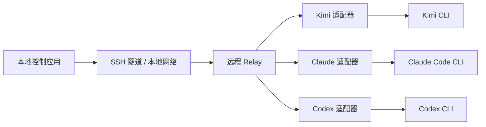

# Agent Control Plane

一个面向远程 AI 编码 CLI 的自托管控制平面。

`Agent Control Plane` 用来统一监控多个远程 agent session，并把分散在不同远程终端里的审批请求汇总到一个本地控制界面中处理。

## Status

当前状态：规划完成，准备进入早期实现阶段。

当前优先级：
- 先完成 `relay` 最小骨架
- 先跑通 Kimi 的单条审批闭环
- 再扩展到本地控制端和多 remote

## 项目定位

这个项目不是聊天 UI，不是 IDE 插件，也不是推理链可视化工具。

它解决的是“运行控制层”的问题：
- 多个 remote 上有多个 agent 在运行
- 不同 CLI 的事件和交互方式不同
- approval request 分散在 SSH 终端里
- 本地缺少一个统一的监控和审批入口

这个项目的核心目标是：

`让远程 agent 的状态和审批请求稳定、统一地回到本地。`

## 目标 Provider

首批目标 provider：
- Kimi Code CLI
- Claude Code CLI
- Codex CLI

接入顺序：
- Kimi
- Claude
- Codex

## 核心能力

- 监控多个远程服务器
- 监控每台服务器上的多个 agent session
- 把不同 provider 的事件统一成一个共享事件模型
- 在本地统一处理 approval request
- 通过 SSH 工作流连接远程环境
- 保持核心层跨平台，避免被单一桌面系统绑定

## MVP 范围

第一个可用版本只包含：
- 一个本地控制应用
- 多个远程服务器
- 每台服务器多个 agent session
- 统一审批队列
- session 列表和状态视图
- approve / reject 流程

第一版统一状态只保留：
- `running`
- `waiting_approval`
- `completed`
- `failed`
- `disconnected`

## Non-Goals

V1 明确不做：
- 完整推理链可视化
- 团队协作和 RBAC
- 云中继服务
- 手机 App
- Windows 桌宠
- macOS 灵动岛界面

## 平台策略

当前平台边界：
- 本地开发平台：Windows
- 本地目标平台：Windows 和 macOS
- 远程 provider 运行平台：Linux

项目从一开始就按“跨平台核心 + 平台专属外壳”设计。

跨平台核心包括：
- `relay`
- 数据模型
- session / approval 状态机
- API
- provider 事件归一化

平台专属外壳包括：
- Windows 托盘或桌面交互壳
- macOS 菜单栏或灵动岛交互壳
- 本地通知渲染

这意味着：
- 现在可以在 Windows 本地开发
- 将来可以把本地控制端迁移到 macOS
- 与 provider CLI、PTY、shell 强相关的验证仍然需要在远程 Linux 上完成

## 架构概览



## 当前实现路线

`Step 1`
先做 `relay` 最小骨架。

`Step 2`
先接 Kimi，跑通单条 approval 闭环。

`Step 3`
再做本地控制端。

`Step 4`
再做多 remote 聚合。

`Step 5`
再做跨平台约束清理和平台验证。

`Step 6`
再接 Claude。

`Step 7`
最后接 Codex 实验支持。

## 仓库结构

```text
agent-control-plane/
├── README.md
├── DEV.md
├── logs/
│   └── 2026-03-31.md
├── relay/
├── adapters/
│   ├── kimi/
│   ├── claude/
│   └── codex/
└── desktop/
```

## Maintainers

如果你是维护者，日常开发主要看：
- `README.md`
- `DEV.md`
- `logs/当天日期.md`

其中：
- `README.md` 负责公开说明项目定位、范围和路线
- `DEV.md` 负责解释架构、实现方式和开发阶段

## License

计划使用：
- `MIT`
或
- `Apache-2.0`
