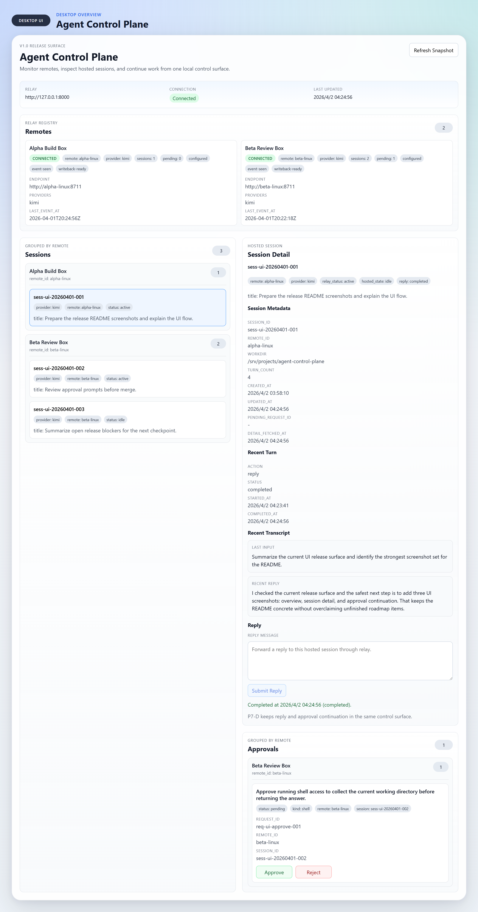
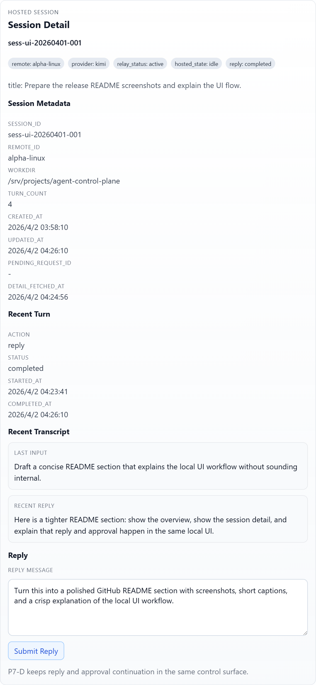
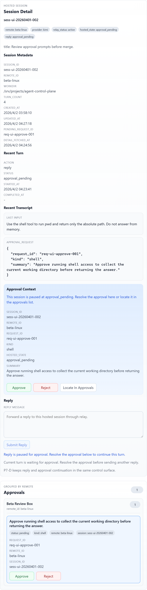

# Agent Control Plane

Self-hosted control plane for remote AI coding sessions.

`desktop -> relay -> remote-agent -> provider native interface`

Agent Control Plane gives you a local UI to view remote hosted sessions, send follow-up
instructions, and handle approvals without going back to each remote shell.

## Status

- Release surface: `v1.0`
- Current verified provider: `Kimi`

`v1.0` has passed a live end-to-end release gate. Public release claims currently cover
the verified `Kimi` path only. `Codex` and `Claude` are not part of the released surface yet.

## Features

- Local desktop view of remote hosted sessions
- Session detail with recent transcript and recent reply
- Local `reply` continuation for the current hosted session
- Local `approve / reject` flow for remote approvals
- Multi-remote aggregation
- Remote operator workflow through `remote-agent`

## Screenshots

### Overview



See remotes, hosted sessions, the selected session detail, and pending approvals in one local control surface.

### Session Detail



Open a hosted session, inspect the recent transcript, and send the next instruction without going back to the remote shell.

### Approval Continuation



When a reply pauses for approval, the decision stays in the same UI context and the result flows back into the current session detail.

## Requirements

- Local control machine: Windows
- Remote execution host: Linux
- Python for `relay` and `remote-agent`
- Node.js / npm for `desktop`
- A working `Kimi` CLI on the remote host

## Quick Start

### 1. Start `relay`

From the repository root:

```powershell
python -m pip install -r requirements-relay.txt
python -m uvicorn relay.main:app --host 127.0.0.1 --port 8000
```

### 2. Start `desktop`

In a second shell:

```powershell
cd desktop
npm install
npm start
```

Default relay endpoint: `http://127.0.0.1:8000`

### 3. Install `remote-agent` on the remote host

On the remote Linux host:

```bash
cd ~/agent-control-plane/remote-agent
bash scripts/install-systemd-user.sh --start
```

Set the required environment values:

```bash
REMOTE_AGENT_RELAY_ENDPOINT=http://<local-relay-host>:8000
REMOTE_AGENT_CONTROL_BASE_URL=http://<remote-host>:8711
REMOTE_AGENT_REMOTE_NAME=<unique-remote-id>
```

Restart the service:

```bash
systemctl --user restart remote-agent.service
```

### 4. Verify `Kimi`

Make sure `kimi` is available on the remote host:

```bash
which kimi
kimi info
```

### 5. Start A Hosted Session

```bash
mkdir -p ~/acp-v1-trial
cd ~/acp-v1-trial
remote-agent kimi start --task "Inspect the current directory and wait for my next instruction."
```

### 6. Use the local UI

In `desktop`, you should be able to:

- see the remote session
- open session detail
- submit a `reply`
- approve or reject an approval request
- see the next result return to the current session detail

## Release Notes

- Current public release surface is `v1.0`
- Current verified provider is `Kimi`
- `Codex` support is in progress under `P9`

This repository is currently released as source code plus operator documentation. It is
not an installer-based desktop product.

## Limitations

- Windows local control machine only
- Linux remote execution host only
- `Kimi` is the only verified provider in the public release surface
- `desktop` is source-run, not installer-based
- `relay` and `remote-agent` are still memory-backed
- `attach`, replay, checkpoint, and restart recovery are not part of `v1.0`

## Documentation

- [desktop/README.md](desktop/README.md)
- [remote-agent/README.md](remote-agent/README.md)
- [README_DEV.md](README_DEV.md)
- [DEV.md](DEV.md)
- `python scripts/generate_readme_screenshots.py`
